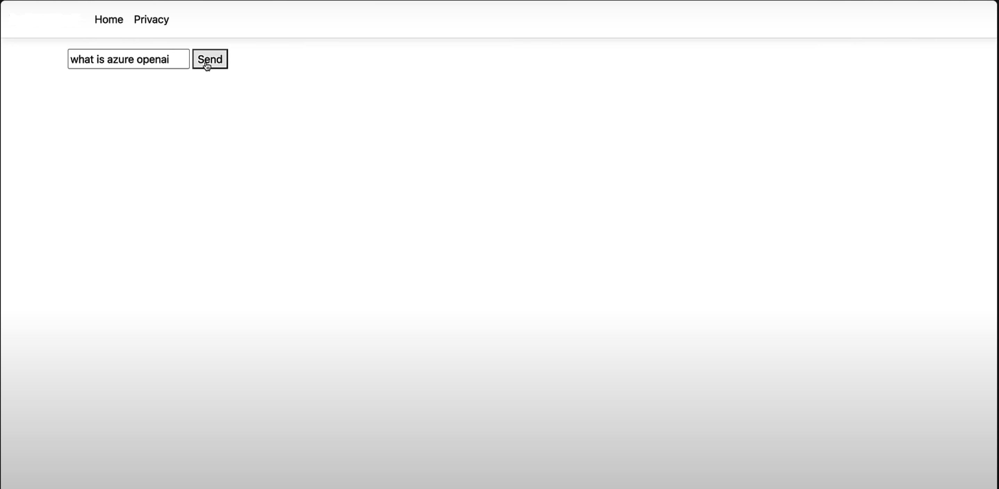
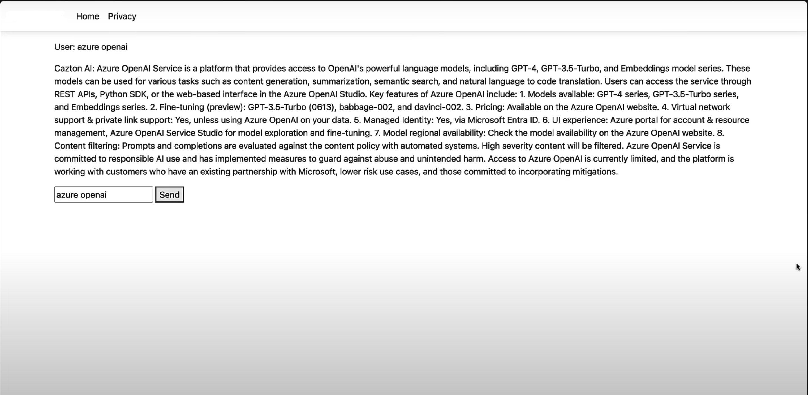

# Chat-Suite

A lightweight web-based AI chatbot application built with C# and ASP.NET MVC that uses Azure OpenAI Service.

The application has real-time chat communication.

### Key Features

- Real-time chat functionality
- Azure OpenAI Service integration
- Responsive user interface
- ASP.NET MVC framework

  
  

