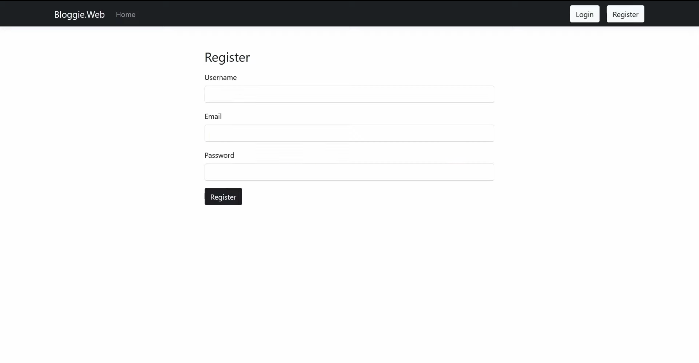
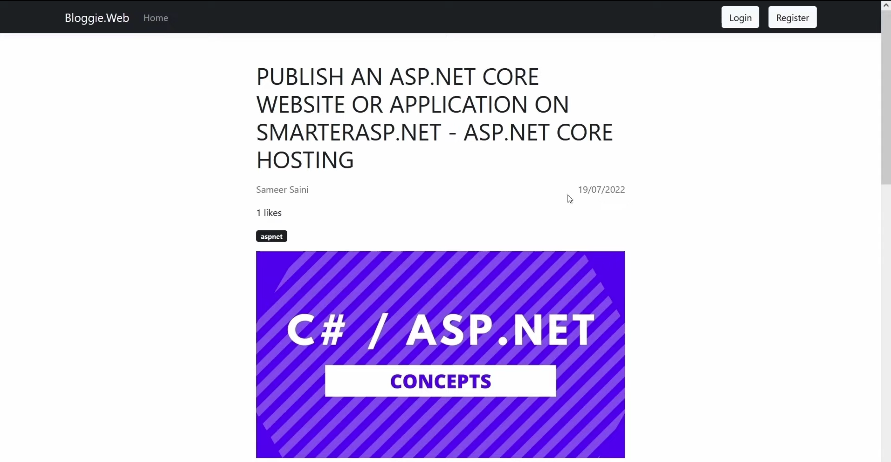
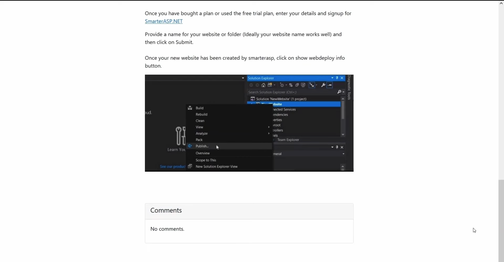
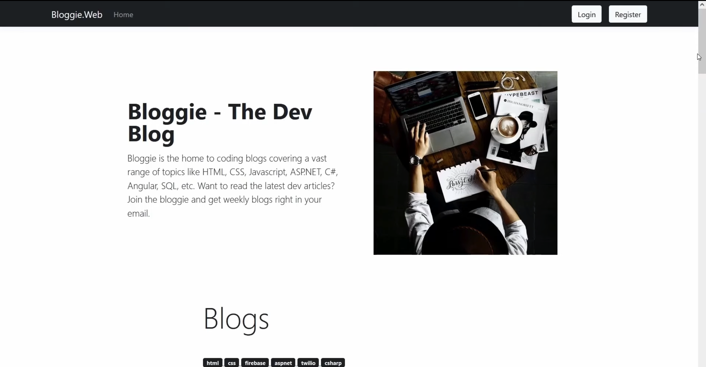

# Dev-Blog

A lightweight blog web-app built with C# and ASP.NET MVC, along with a MySQL database backend. Provides core blogging functionality such as, the ability to create, edit, and delete posts. Simple user authentication also incorporated.

## Overview

This project serves as a practical exploration of enterprise development patterns, demonstrating implementation of CRUD operations and modern ORM tools.

### Key Features

- User authentication
- Complete CRUD functionality for blog posts
- Entity Framework Core ORM integration
- MySQL database management

  
  
  
  

